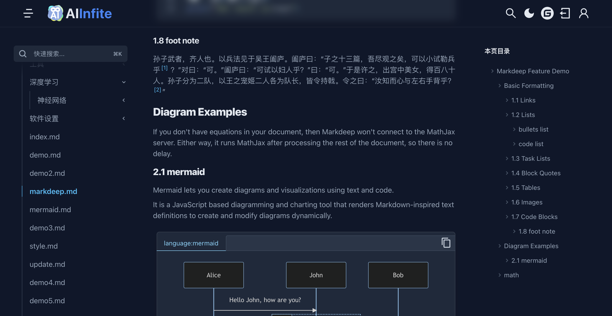
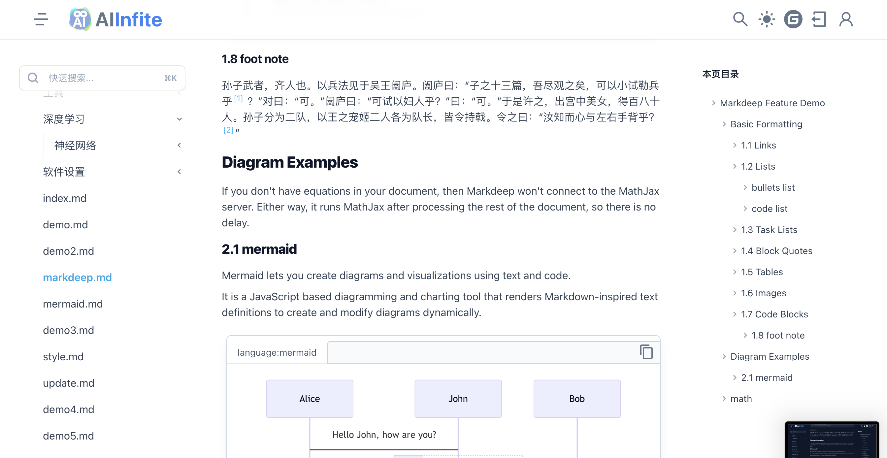
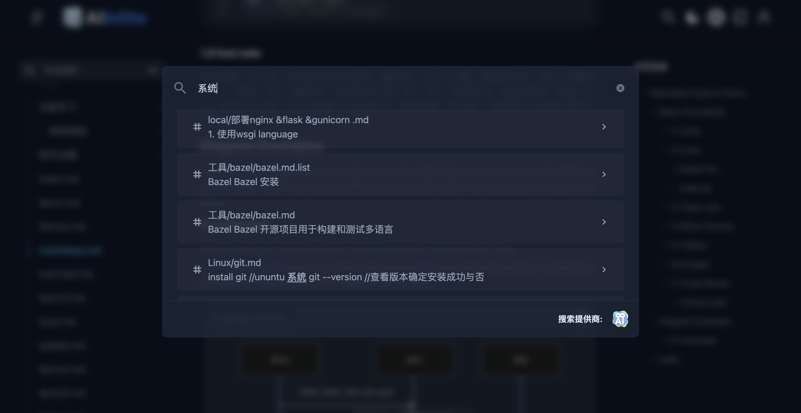
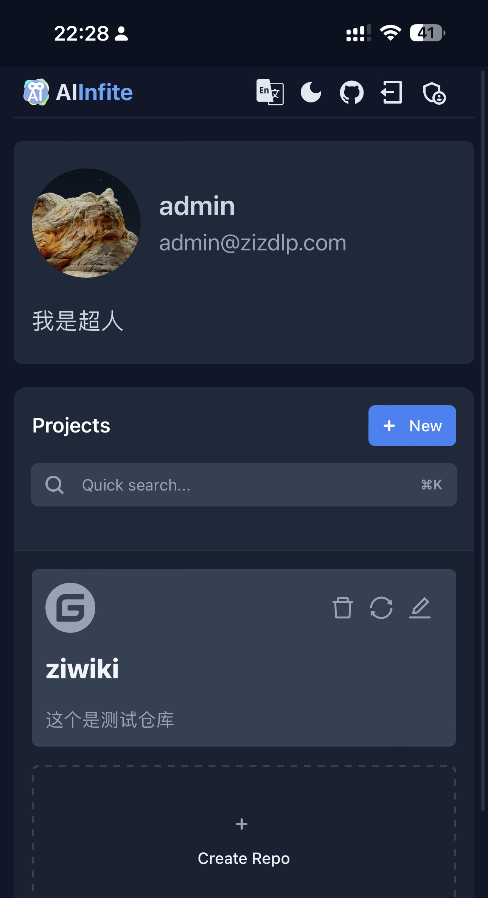
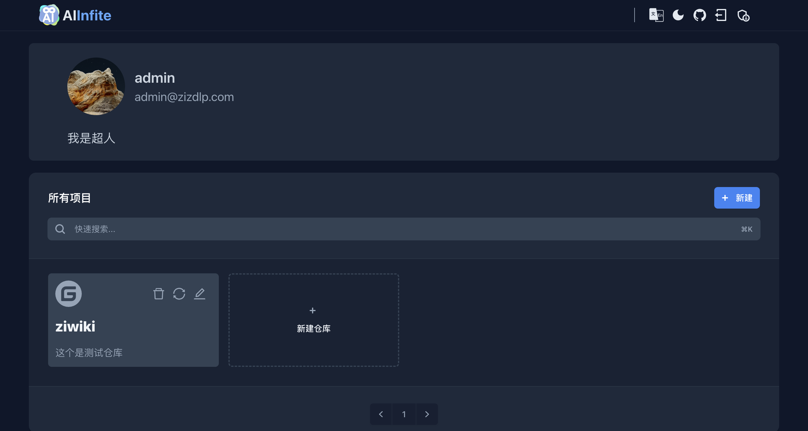
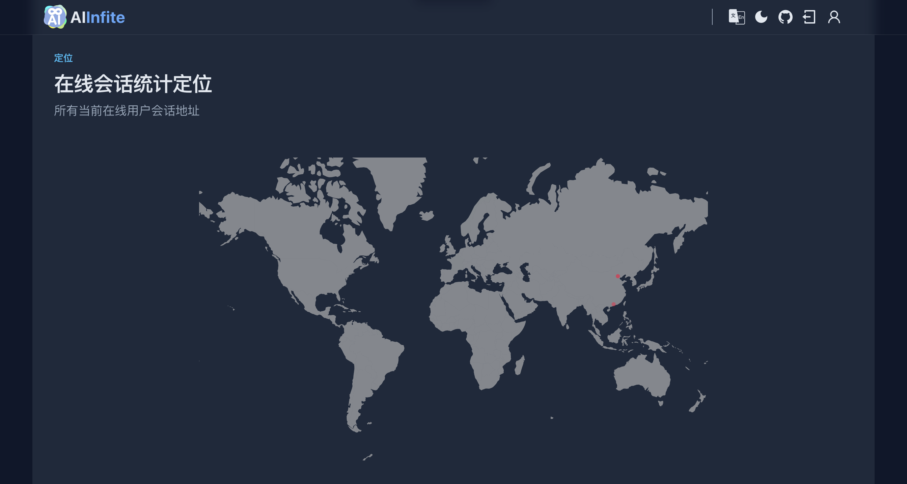

# ZIWIKI

## 动机

之前使用gitbook挺喜欢的，但是由于在国外，服务经常连不上，现在更难使用了，此外还不能有效导出（免费用户)，后来使用mkdocs，中文检索、私密性都有些问题。自己做希望能达到若干期望:

- 私密：不是博客谁都可以看，所以自然有授权功能（登陆
- 在线同步：本地使用git commit，然后云上自动同步
- 中英文全文检索
- 好看（符合自己的偏好）
- 快

## 功能

### 1. 夜间模式

  支持日间模式夜间无缝模式切换

  
  

### 2. 全文搜索

  利用postgres的全文检索功能，支持中英文全文检索
  

### 3. 响应式

支持手机、电脑等不同屏幕规格

### 中英文切换

### mermaid、math、code highlight

除了基础的markdown语法外，支持mermaid表格、代码高亮、数学公式等。

### 多用户

管理员除了具有普通用户的功能外，账号可以查看其他用户状态(用户基本信息、ip、地理位置、会话状态），封禁特定用户，（关闭、开放）注册

## 使用

可以选择在本地测试、或者部署到服务器，需要预先安装docker，docker-compose等。

### 先决条件

- docker & docker compose（请上网搜索）
- postgres 需要安装pg-jieba扩展，具体见build文件夹 postgres build相关内容。
- ip-geo，需要自己申请免费账号，以便查看用户的ip对应地理位置（如果不需要这个功能可以直接忽视这个）
- 首先需要本地构建deps 镜像（如果下面的compose 使用image模式而不是build模式（注释掉了），其他镜像也需要提前构建）

### 参数配置

- todo

### 本地http模式

进入run文件夹：`bash run dev_compose.sh`

### 服务器https模式

- 先更换cer文件夹中bundle key&cert ssl证书文件，更换nginx配置文件中域名信息
- 可以选择从文件夹构建各镜像(注释`image:`，也可以选择compose构建各镜像（注释`build:`)
进入run文件夹：`bash run prod_compose.sh`
