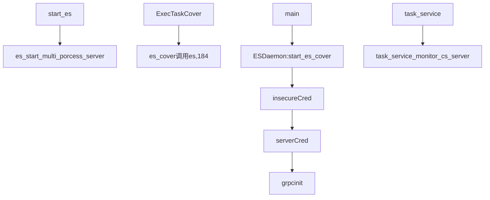

# <font color = "darkblue"><center>归一化以及正则化</center></font>
1. 归一化的必要性:
考虑梯度下降优化，未归一化两个维度更新幅度不一样，导致收敛慢

### batchnorm
<hr>
对一个批次的数据，进行均值方差归一化:(每个维度分别计算)
$$y=\frac{x-E(x)}{\sqrt{ Var(x)+\epsilon}}*\gamma+\beta$$
其中参数分别默认设为1,0


```python
import numpy as np
x=np.random.random([10,4])
```


```python
def batchnorm(x):
    """
    x.shape:b,dim
    """
    mu=np.sum(x,0)/x.shape[0]

    var=0
    for i in range(len(x)):
        var+=(x[i]-mu)*(x[i]-mu) 
    var=var/x.shape[0]
    e=0.000000001
    return (x-mu)/(np.sqrt(var)+e)
batchnorm(x).shape
```


    (10, 4)


### layer norm
<hr>
可以认为是同一个样本不同维度共享相同的均值和方差;由于batch norm 采用批次数据估计全数据的均值方差，对batch size 有要求，而且很难应用到rnn上. 此外，一个神经元的输出，收到上层各个神经元的影响.
采用层正则化:不同维度共享均值方差，不同样本则不同，
$$y=\frac{x-E(x)}{\sqrt{ Var(x)+\epsilon}}*\gamma+\beta$$


```python
def layernorm(x):
    """
    x.shape:b,dim
    """
    ####维度交换
    x=x.transpose(1,0)
    mu=np.sum(x,0)/x.shape[0]

    var=0
    for i in range(len(x)):
        var+=(x[i]-mu)*(x[i]-mu) 
    var=var/x.shape[0]
    e=0.000000001
    return (x-mu)/(np.sqrt(var)+e)
layernorm(x).shape
```


    (4, 10)


### 正则化
L1,L2，
正则化:$$loss=(lossold+a*||w||^2_2)$$
    考虑梯度更新:dw=dw_old+a*2*w;
更新时w_new=w_old-k*dw

![Figure [robot]: Gelu](./assets/regu.png)
为啥 正则化降低过拟合(高方差),考虑线性拟合，正则化对权重做了限制（比如取值0，网络结构缩小，高级拟合变低级拟合），防止过学习细节。

考虑正则化项的权重参数a:
考虑tanh 激活函数， a设置过大，会导致w小，tanh的取值是接近线性部分，也就是没有激活函数，也就是只有一层线性层，欠拟合。；a设置的小，w取得大，tanh接近0，也就是没有激活函数，也就是只有一层线性层，欠拟合。

## 2 - L2 Regularization

The standard way to avoid overfitting is called **L2 regularization**. It consists of appropriately modifying your cost function, from:
$$
J = -\frac{1}{m} \sum\limits_{i = 1}^{m} \large{(}\small  y^{(i)}\log\left(a^{[L](i)}\right) + (1-y^{(i)})\log\left(1- a^{[L](i)}\right) \large{)} \tag{1}
$$
To:

$$
J_{regularized} = \small \underbrace{-\frac{1}{m} \sum\limits_{i = 1}^{m} \large{(}\small y^{(i)}\log\left(a^{[L](i)}\right) + (1-y^{(i)})\log\left(1- a^{[L](i)}\right) \large{)} }_\text{cross-entropy cost} + \underbrace{\frac{1}{m} \frac{\lambda}{2} \sum\limits_l\sum\limits_k\sum\limits_j W_{k,j}^{[l]2} }_\text{L2 regularization cost} \tag{2}
$$

Let's modify your cost and observe the consequences.

**Exercise**: Implement `compute_cost_with_regularization()` which computes the cost given by formula (2). To calculate $\sum\limits_k\sum\limits_j W_{k,j}^{[l]2}$  , use :
```python
np.sum(np.square(Wl))
```
Note that you have to do this for $W^{[1]}$, $W^{[2]}$ and $W^{[3]}$, then sum the three terms and multiply by $ \frac{1}{m} \frac{\lambda}{2} $.

### dropout
防止过拟合的原因；可以认为dropout 使得模型结构每次都不一样；类似于baging

训练时采用，测试时不采用；
前向传播，使得一部分神经元失活D，反向传播同样da *D;D是0,1矩阵

## 3 - Dropout

Finally, **dropout** is a widely used regularization technique that is specific to deep learning. 
**It randomly shuts down some neurons in each iteration.** Watch these two videos to see what this means!

<!--
To understand drop-out, consider this conversation with a friend:
- Friend: "Why do you need all these neurons to train your network and classify images?". 
- You: "Because each neuron contains a weight and can learn specific features/details/shape of an image. The more neurons I have, the more featurse my model learns!"
- Friend: "I see, but are you sure that your neurons are learning different features and not all the same features?"
- You: "Good point... Neurons in the same layer actually don't talk to each other. It should be definitly possible that they learn the same image features/shapes/forms/details... which would be redundant. There should be a solution."
!--> 


<center>
<video width="620" height="440" src="images/dropout1_kiank.mp4" type="video/mp4" controls>
</video>
</center>
<br>
<caption><center> <u> Figure 2 </u>: Drop-out on the second hidden layer. <br> At each iteration, you shut down (= set to zero) each neuron of a layer with probability $1 - keep\_prob$ or keep it with probability $keep\_prob$ (50% here). The dropped neurons don't contribute to the training in both the forward and backward propagations of the iteration. </center></caption>

<center>
<video width="620" height="440" src="images/dropout2_kiank.mp4" type="video/mp4" controls>
</video>
</center>

<caption><center> <u> Figure 3 </u>: Drop-out on the first and third hidden layers. <br> $1^{st}$ layer: we shut down on average 40% of the neurons.  $3^{rd}$ layer: we shut down on average 20% of the neurons. </center></caption>


When you shut some neurons down, you actually modify your model. The idea behind drop-out is that at each iteration, you train a different model that uses only a subset of your neurons. With dropout, your neurons thus become less sensitive to the activation of one other specific neuron, because that other neuron might be shut down at any time. 

### 3.1 - Forward propagation with dropout

**Exercise**: Implement the forward propagation with dropout. You are using a 3 layer neural network, and will add dropout to the first and second hidden layers. We will not apply dropout to the input layer or output layer. 

**Instructions**:
You would like to shut down some neurons in the first and second layers. To do that, you are going to carry out 4 Steps:
1. In lecture, we dicussed creating a variable $d^{[1]}$ with the same shape as $a^{[1]}$ using `np.random.rand()` to randomly get numbers between 0 and 1. Here, you will use a vectorized implementation, so create a random matrix $D^{[1]} = [d^{[1](1)} d^{[1](2)} ... d^{[1](m)}] $ of the same dimension as $A^{[1]}$.
2. Set each entry of $D^{[1]}$ to be 1 with probability (`keep_prob`), and 0 otherwise.

**Hint:** Let's say that keep_prob = 0.8, which means that we want to keep about 80% of the neurons and drop out about 20% of them.  We want to generate a vector that has 1's and 0's, where about 80% of them are 1 and about 20% are 0.
This python statement:  
`X = (X < keep_prob).astype(int)`  

is conceptually the same as this if-else statement (for the simple case of a one-dimensional array) :

```
for i,v in enumerate(x):
    if v < keep_prob:
        x[i] = 1
    else: # v >= keep_prob
        x[i] = 0
```
Note that the `X = (X < keep_prob).astype(int)` works with multi-dimensional arrays, and the resulting output preserves the dimensions of the input array.

Also note that without using `.astype(int)`, the result is an array of booleans `True` and `False`, which Python automatically converts to 1 and 0 if we multiply it with numbers.  (However, it's better practice to convert data into the data type that we intend, so try using `.astype(int)`.)

3. Set $A^{[1]}$ to $A^{[1]} * D^{[1]}$. (You are shutting down some neurons). You can think of $D^{[1]}$ as a mask, so that when it is multiplied with another matrix, it shuts down some of the values.
4. Divide $A^{[1]}$ by `keep_prob`. By doing this you are assuring that the result of the cost will still have the same expected value as without drop-out. (This technique is also called inverted dropout.)

### 3.2 - Backward propagation with dropout

**Exercise**: Implement the backward propagation with dropout. As before, you are training a 3 layer network. Add dropout to the first and second hidden layers, using the masks $D^{[1]}$ and $D^{[2]}$ stored in the cache. 

**Instruction**:
Backpropagation with dropout is actually quite easy. You will have to carry out 2 Steps:
1. You had previously shut down some neurons during forward propagation, by applying a mask $D^{[1]}$ to `A1`. In backpropagation, you will have to shut down the same neurons, by reapplying the same mask $D^{[1]}$ to `dA1`. 
2. During forward propagation, you had divided `A1` by `keep_prob`. In backpropagation, you'll therefore have to divide `dA1` by `keep_prob` again (the calculus interpretation is that if $A^{[1]}$ is scaled by `keep_prob`, then its derivative $dA^{[1]}$ is also scaled by the same `keep_prob`).


```python

```




| Syntax      | Description |
| ----------- | ----------- |
| Header      | Title       |
| Paragraph   | Text        |