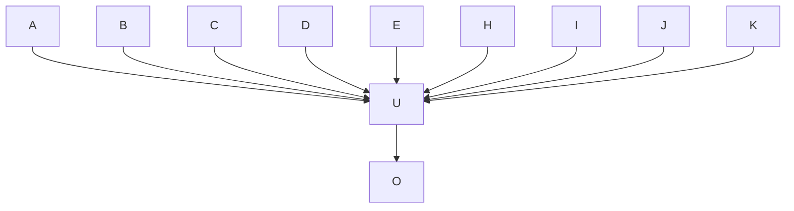

# 这是一篇示范文档

> **摘要**：战城南，死郭北，野死不葬乌可食。为我谓乌：且为客豪！野死谅不葬，俯腐肉安能去子逃？水深激激，蒲苇冥冥；枭骑战斗死，驽马徘徊鸣。
梁筑室，何以南？何以北？禾黍不获君何食？愿为忠臣安可得？思子良臣，良臣诚可思：朝行出攻，暮不夜归！?

## 司马迁

### 写史记动机

司马迁著《史记》，其史学观念在于“究天人之际，通古今之变，成一家之言”。而他的撰述动机，主要有以下三方面：

#### 遗志

司马迁为了继承其父司马谈编订史书的遗志，完成撰述《史记》的宏愿。司马氏在周朝时世为史官，春秋时期虽然失去官职，司马谈却把修撰史书视为自己的神圣职责，一心继承先人

#### 春秋精神

司马迁想继承《春秋》精神。司马迁在《太史公自序》说：“先人有言，自周公卒，五百岁而有孔子，孔子卒后，至于今五百岁，有能绍明世，正《易传》、继《春秋》、本《诗》、《书》、《礼》、《乐》之际，意在斯乎？意在斯乎？小子何敢让焉？”此正暗示其有明道

### 史记片段

#### 孙子吴起列传

孙子武者，齐人也。以兵法见于吴王阖庐。阖庐曰：“子之十三篇，吾尽观之矣，可以小试勒兵乎[^1]  ？”对曰：“可。”阖庐曰：“可试以妇人乎？”曰：“可。”于是许之，出宫中美女，得百八十人。孙子分为二队，以王之宠姬二人各为队长，皆令持戟。令之曰：“汝知而心与左右手背乎？”

#### 第二节：项羽本纪

项籍者，下相人也，字羽。太史公曰：吾闻之周生曰“舜目盖重瞳子”，又闻项羽亦重瞳子。羽岂其苗裔邪？何兴之暴也！夫秦失其政，陈涉首难，豪杰蜂起！[^2]

## 第二章

### 代码

孙子分为二队，以王之宠姬二人各为队长，皆令持戟。令之曰：“汝知而心与左右手背乎？”孙子分为二队，以王之宠姬二人各为队长，皆令持戟。令之曰：“汝知而心与左右手背乎？”

```python
import numpy as np
import pandas as pd
from pnumpy import type as t

# 这是行注释
# 这是行注释
def batchnorm(x):                   
    """                            
    x.shape:b,dim
    """
    mu=np.sum(x,0)/x.shape[0]
    var=0
    for i in range(len(x)):
        var+=(x[i]-mu)*(x[i]-mu) 
    var=var/x.shape[0]
    e=0.000000001
    return (x-mu)/(np.sqrt(var)+e)
print(batchnorm(x).shape)
```

### 行内公式

正则化:$loss=(lossold+a*||w||^2_2)$

### 块公式

The standard way to avoid overfitting is called **L2 regularization**. It consists of appropriately modifying your cost function, from:
$$
J = -\frac{1}{m} \sum\limits_{i = 1}^{m} \large{(}\small  y^{(i)}\log\left(a^{[L](i)}\right) + (1-y^{(i)})\log\left(1- a^{[L](i)}\right) \large{)} \tag{1}
$$
To:

$$
J_{regularized} = \small \underbrace{-\frac{1}{m} \sum\limits_{i = 1}^{m} \large{(}\small y^{(i)}\log\left(a^{[L](i)}\right) + (1-y^{(i)})\log\left(1- a^{[L](i)}\right) \large{)} }_\text{cross-entropy cost} + \underbrace{\frac{1}{m} \frac{\lambda}{2} \sum\limits_l\sum\limits_k\sum\limits_j W_{k,j}^{[l]2} }_\text{L2 regularization cost} \tag{2}
$$

### mermaid



### 表格

下面是表格`printf()` 函数,这里是行内代码`A+B==C`

| ColumnA | ColumnB | ColumnC| ColumnD|
|-----------|-----------|-----------| ----|
| row11     | row12     | row13     | row14|
| row21     | row22     | row23     | row24|
| row31     | row32     | row33     | row34|
| row41     | row42     | row43     | row44|

[^1]:汉羽本纪 汉典古籍[引用日期2021-03-16]
[^2]:项羽本纪 汉典古籍[引用日期2021-03-16]
